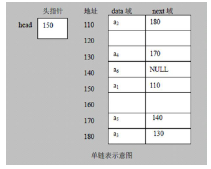

# 1、内容介绍和授课方式

## 1.1 数据结构和算法内容介绍

### 1.1.1 先看几道经典的算法面试题

（1）KMP算法


（2）分治算法


（3）回溯算法


（4）图的深度优先遍历算法+贪心算法优化


## 1.2 线性结构和非线性结构

**数据结构包括:**线性结构和非线性结构。l

### 1.2.1 线性结构

1)线性结构作为最常用的数据结构，其特点是**数据元素之间存在一对一**的线性关系
2)线性结构有两种不同的存储结构，即**顺序存储结构(数组)和链式存储结构(链表)**。顺序存储的线性表称为顺序表，顺序表中的**存储元素是连续**的
3)链式存储的线性表称为链表，链表中的**存储元素不一定是连续的**，元素节点中存放数据元素以及相邻元素的地
址信息
4)线性结构常见的有:**数组、队列、链表和栈**.

### 1.2.2 非线性结构

非线性结构包括:二维数组，多维数组，广义表，树结构,图结构

# 2、稀疏数组和队列

## 2.1 稀疏sparsearray数组

### 2.2.1 稀疏数组实例


### 2.2.2 稀疏数组应用场景

当一个数组中大部分元素为0，或者为同一个值的数组时，可以使用稀疏数组来保存该数组。
稀疏数组的处理方法是:
1)记录数组一共有几行几列，有多少个不同的值
2)把具有不同值的元素的行列及值记录在一个小规模的数组中，从而缩小程序的规模


### 2.2.3 稀疏数组应用实例


### 2.2.4 代码实现

```java
public class SparseArray {
    public static void main(String[] args) {
        //创建一个原始的二维数组11*11
        //0表示没有棋子，1表示黑子，2表示蓝子
        int chessArr1[][] = new int[11][11];
        chessArr1[1][2] = 1;
        chessArr1[2][3] = 2;
        //输出原始的二维数组
        System.out.println("原始的二维数组");
        for(int[] row : chessArr1){
            for (int data : row) {
                System.out.printf("%d\t",data);
            }
            System.out.println();
        }

        //将二维数组 转 稀疏数组
        //1、先遍历二维数组，得到非0数据的个数
        int sum = 0;
        for (int i = 0; i < 11; i++) {
            for (int j = 0; j < 11; j++) {
                if(chessArr1[i][j]!=0)sum++;
            }
        }
        System.out.println("sum= "+sum);

        //创建对应的稀疏数组
        int sparseArr[][] = new int[sum+1][3];
        //给稀疏数组赋值
        sparseArr[0][0] = 11;
        sparseArr[0][1] = 11;
        sparseArr[0][2] = 3;
        //遍历二维数组，将值存储到稀疏数组中
        int count = 0;
        for (int i = 0; i < 11; i++) {
            for (int j = 0; j < 11; j++) {
                if(chessArr1[i][j]!=0){
                    count++;
                    sparseArr[count][0] = i;
                    sparseArr[count][1] = j;
                    sparseArr[count][2] = chessArr1[i][j];
                }
            }
        }

        //输出稀疏数组
        System.out.println();
        System.out.println("得到的稀疏数组：");
        for(int i = 0; i<sparseArr.length; i++){
            System.out.printf("%d\t%d\t%d",sparseArr[i][0],sparseArr[i][1],sparseArr[i][2]);
            System.out.println();
        }
        System.out.println();

        //将稀疏数组还原成原始数组
        //先读取第一行获取原属数组的行和列
        int chessArr2[][] = new int[sparseArr[0][0]][sparseArr[0][1]];

        for (int i = 1; i < sparseArr.length; i++) {
            chessArr2[sparseArr[i][0]][sparseArr[i][1]] = sparseArr[i][2];
        }
        
        for (int[] row:
             chessArr2) {
            for (int data:
                 row) {
                System.out.printf("%d\t",data);
            }
            System.out.println();
        }
    }
}

```

运行结果：


### 2.2.5 课后练习

要求:
1)在前面的基础上，将稀疏数组保存到磁盘上，比如map.data

2)恢复原来的数组时，读取map.data进行恢复

```java
import java.io.*;

public class SparseArray {
    public static void main(String[] args) {
        //创建一个原始的二维数组11*11
        //0表示没有棋子，1表示黑子，2表示蓝子
        int chessArr1[][] = new int[11][11];
        chessArr1[1][2] = 1;
        chessArr1[2][3] = 2;
        //输出原始的二维数组
        System.out.println("原始的二维数组");
        for(int[] row : chessArr1){
            for (int data : row) {
                System.out.printf("%d\t",data);
            }
            System.out.println();
        }

        //将二维数组 转 稀疏数组
        //1、先遍历二维数组，得到非0数据的个数
        int sum = 0;
        for (int i = 0; i < 11; i++) {
            for (int j = 0; j < 11; j++) {
                if(chessArr1[i][j]!=0)sum++;
            }
        }
        System.out.println("sum= "+sum);

        //创建对应的稀疏数组
        int sparseArr[][] = new int[sum+1][3];
        //给稀疏数组赋值
        sparseArr[0][0] = 11;
        sparseArr[0][1] = 11;
        sparseArr[0][2] = 2;
        //遍历二维数组，将值存储到稀疏数组中
        int count = 0;
        for (int i = 0; i < 11; i++) {
            for (int j = 0; j < 11; j++) {
                if(chessArr1[i][j]!=0){
                    count++;
                    sparseArr[count][0] = i;
                    sparseArr[count][1] = j;
                    sparseArr[count][2] = chessArr1[i][j];
                }
            }
        }

        //输出稀疏数组
        System.out.println();
        System.out.println("得到的稀疏数组：");
//      1)在前面的基础上，将稀疏数组保存到磁盘上，比如map.data存的是sparseArr

        for(int i = 0; i<sparseArr.length; i++){
            System.out.printf("%d\t%d\t%d",sparseArr[i][0],sparseArr[i][1],sparseArr[i][2]);
            System.out.println();
        }
        System.out.println();
        String filePath = "E:\\Desktop\\java数据结构与算法\\代码\\sparsearry\\mydata";
        File dir = new File(filePath);
        if(!dir.exists()){dir.mkdirs();}
        File checFile = new File(filePath+"\\map.data");
        FileWriter writer = null;
        if(!checFile.exists()) {
            try {
                checFile.createNewFile();
                //写入内容
                writer = new FileWriter(checFile,false);
                for(int i = 0; i<sparseArr.length; i++){
                    writer.append(sparseArr[i][0]+" "+sparseArr[i][1]+" "+sparseArr[i][2]+"\r\n");

                }
                writer.flush();
            } catch (IOException e) {
                e.printStackTrace();
            }
        }


        //将稀疏数组还原成原始数组
        //先读取第一行获取原属数组的行和列
        //2)恢复原来的数组时，读取map.data进行恢复，用的chessArr2接受
        File new_dir = new File(filePath+"\\map.data");
        Reader reader = null;
        StringBuilder str_data = new StringBuilder();
        if(new_dir.exists()){
            try {
                reader = new FileReader(new_dir);
                char[] chs = new char[1024];
                int len = 0;
                while((len=reader.read(chs))!=-1){

                    str_data.append(chs);
                    //System.out.println(chs);
                }
            } catch (FileNotFoundException e) {
                e.printStackTrace();
            } catch (IOException e) {
                e.printStackTrace();
            }
        }
        String s_data = str_data.toString();
        String[] strings = s_data.split("\r\n");

//        String[] s1 = strings[0].split(" ");
//
//        sparseArr[0][0] = Integer.parseInt(s1[0]);
//        sparseArr[0][1] = Integer.parseInt(s1[1]);
//        sparseArr[0][2] = Integer.parseInt(s1[2]);


        int[][] new_sparseArr = new int[sum+1][3];
        for (int i = 0; i < strings.length-1; i++) {

            for (int j = 0; j < strings[i].split(" ").length; j++) {
                new_sparseArr[i][j] = Integer.parseInt(strings[i].split(" ")[j]);
            }
        }
        for (int[] row :
                new_sparseArr) {
            for (int data :
                    row) {
                System.out.printf("%d\t",data);
            }
            System.out.println();
        }
//        System.out.println(strings.length);


//        System.out.println(str_data.toString());

        int chessArr2[][] = new int[new_sparseArr[0][0]][sparseArr[0][1]];

        for (int i = 1; i < new_sparseArr.length; i++) {
            chessArr2[new_sparseArr[i][0]][new_sparseArr[i][1]] = new_sparseArr[i][2];
        }

        for (int[] row:
             chessArr2) {
            for (int data:
                 row) {
                System.out.printf("%d\t",data);
            }
            System.out.println();
        }

    }
}

```

## 2.2 队列

### 2.2.1 队列介绍

​		队列是一个有序列表，可以用数组或是链表来实现。
遵循**先入先出**的原则。即:先存入队列的数据，要先取出。后存入的要后取出
示意图:(使用数组模拟队列示意图)


​		队列本身是有序列表，若使用数组的结构来存储队列的数据，则队列数组的声明如下图,其中maxSize是该队列的最大容量。
​		因为队列的输出、输入是分别从前后端来处理，因此需要两个变量front及rear分别记录队列前后端的下标，front 会随看数据输出而改变，而rear则是随着数据输入而改变。

### 2.2.2 数组模拟队列

当我们将数据存入队列时称为”addQueue"，addQueue的处理需要有两个步骤:思路分析
1)将尾指针往后移:rear+1，当front == rear【空】
2)若尾指针rear小于队列的最大下标maxSize-1，则将数据存入rear所指的数
组元素中，否则无法存入数据。rear == maxSize-1[队列满]

### 2.2.3 数组模拟队列代码实现

```java
package Queen;

import java.util.Scanner;

public class QueueArray {
    public static void main(String[] args) {
        //创建一个队列
        ArrayQueue queue = new ArrayQueue(3);
        char key = ' ';
        Scanner scanner = new Scanner(System.in);
        boolean loop = true;
        while (loop){
            System.out.println("s(show):显示队列");
            System.out.println("e(exit):退出队列");
            System.out.println("a(add):添加数据到队列");
            System.out.println("g(get):从队列取出数据");
            System.out.println("h(head):查看队列头数据");
            key = scanner.next().charAt(0);
            switch (key){
                case 's':
                    queue.showQueue();
                    break;
                case 'a':
                    System.out.println("输出一个数");
                    int val = scanner.nextInt();
                    queue.addQueue(val);
                    break;
                case 'g':
                    try{
                        int res = queue.getQueue();
                        System.out.printf("取出的数据是%d\n",res);
                    }catch (Exception e){
                        System.out.println(e.getMessage());
                    }
                    break;
                case 'h':
                    try{
                        int res = queue.headQueue();
                        System.out.printf("取出的头数据是%d\n",res);
                    }catch (Exception e){
                        System.out.println(e.getMessage());
                    }
                    break;
                case 'e':
                    scanner.close();
                    loop = false;
                    break;
            }
        }
        System.out.println("程序退出");
    }
}

class ArrayQueue{
    private int maxSize;//数组的最大容量
    private int front;//队列头
    private int rear;//队列尾
    private int[] arr;//该数据用于存储数据，模拟队列

    //创建队列的构造器
    public  ArrayQueue(int arrMaxSize){
        maxSize = arrMaxSize;
        arr = new int[maxSize];
        front = -1;//指向队列头部，列头的前一个位置
        rear = -1;//只想队列尾部，指向队列最后一个数据

    }

    //判断队列是否满
    public boolean isFull(){
        return rear==maxSize-1;
    }

    //判断数列是否为空
    public boolean isEmpty(){
        return rear==front;
    }

    //添加数据到队列
    public void addQueue(int n){
        //先判断队列是否满
        if(isFull())
        {
            System.out.println("队列已满，不能添加数据");
            return;
        }
        rear++;
        arr[rear] = n;
    }

    //数据出队列
    public  int getQueue(){
        //判断是否为空
        if(isEmpty()){
            //通过抛出异常来处理
            throw new RuntimeException("队列空，不能取数据");
        }
        front++;
        return arr[front];
    }
    
    //显示队列的所有数据
    public void showQueue(){
        //遍历
        if(isEmpty()){
            System.out.println("队列空，没有数据");
            return;
        }
        for (int i :
                arr) {
            System.out.printf("arr[%d]=%d\n",i,arr[i]);
        }
    }

    //显示队列头数据
    public int headQueue(){
        if (isEmpty()){
            throw new RuntimeException("队列空，没有数据");
        }
        return arr[front+1];
    }


}
```

问题分析与优化：

1)目前数组使用一次就不能用，没有达到复用的效果

2)将这个数组使用算法,改进成一个环形的队列取模; %


### 2.2.4 数组模拟环形队列

思路：


### 2.2.5 数组模拟环形队列代码实现

```java
package Queen;

import java.util.Scanner;

public class CircleQueueArray {
    public static void main(String[] args) {
        //创建一个队列
        CircleArray queue = new CircleArray(4);
        char key = ' ';
        Scanner scanner = new Scanner(System.in);
        boolean loop = true;
        while (loop){
            System.out.println("s(show):显示队列");
            System.out.println("e(exit):退出队列");
            System.out.println("a(add):添加数据到队列");
            System.out.println("g(get):从队列取出数据");
            System.out.println("h(head):查看队列头数据");
            key = scanner.next().charAt(0);
            switch (key){
                case 's':
                    queue.showQueue();
                    break;
                case 'a':
                    System.out.println("输出一个数");
                    int val = scanner.nextInt();
                    queue.addQueue(val);
                    break;
                case 'g':
                    try{
                        int res = queue.getQueue();
                        System.out.printf("取出的数据是%d\n",res);
                    }catch (Exception e){
                        System.out.println(e.getMessage());
                    }
                    break;
                case 'h':
                    try{
                        int res = queue.headQueue();
                        System.out.printf("取出的头数据是%d\n",res);
                    }catch (Exception e){
                        System.out.println(e.getMessage());
                    }
                    break;
                case 'e':
                    scanner.close();
                    loop = false;
                    break;
            }
        }
        System.out.println("程序退出");
    }
}


class CircleArray {
    private int maxSize;//数组的最大容量
    private int front;//队列头
    private int rear;//队列尾
    private int[] arr;//该数据用于存储数据，模拟队列

    public CircleArray(int maxSize) {
        this.maxSize = maxSize;
        arr = new int[maxSize];
        //front 和 rear 初始值为0，因此可以不初始化
    }

    //判断队列是否满
    public boolean isFull(){
        return (rear+1)%maxSize==front;
    }

    //判断数列是否为空
    public boolean isEmpty(){
        return rear==front;
    }

    //添加数据到队列
    public void addQueue(int n){
        //先判断队列是否满
        if(isFull())
        {
            System.out.println("队列已满，不能添加数据");
            return;
        }
        //直接在末尾位置添加元素
        arr[rear] = n;
        rear = (rear+1)%maxSize;
    }

    //数据出队列
    public  int getQueue(){
        //判断是否为空
        if(isEmpty()){
            //通过抛出异常来处理
            throw new RuntimeException("队列空，不能取数据");
        }
        int temp = arr[front];
        front = (front+1)%maxSize;

        return temp;
    }

    //显示队列的所有数据
    public void showQueue(){
        //遍历
        if(isEmpty()){
            System.out.println("队列空，没有数据");
            return;
        }
        for (int i = front; i <front+len() ; i++) {
            System.out.printf("arr[%d]=%d\n",i%maxSize,arr[i%maxSize]);
        }

    }

    //求出当前数列有效元素的个数
    public int len(){
        return (rear+maxSize-front)%maxSize;
    }

    //显示队列头数据
    public int headQueue(){
        if (isEmpty()){
            throw new RuntimeException("队列空，没有数据");
        }
        return arr[front];
    }

}

```


# 3、链表

## 3.1 链表介绍

链表是有序的，但是在内存中并不是：



链表的特点：

1. 链表是以节点的方式来存储,是**链式存储**
2. 每个节点包含data 域, next域:指向下一个节点.
3. 链表的**各个节点不一定是连续存储.**
4. 链表分**带头节点的链表**和**没有头节点的链表**，根据实际的需求来确定

## 3.2 单向链表的代码实现

思路：

用HeroNode来表示单个节点
用SingleLinkedList来管理链表（增删改查）

```java
public class SingleLinkedListDemo {
    public static void main(String[] args) {
        //测试
        //先创建节点
        HeroNode hero1 = new HeroNode(1,"宋江","及时雨");
        HeroNode hero2 = new HeroNode(2,"卢俊义","玉麒麟");
        HeroNode hero3 = new HeroNode(3,"吴用","智多星");
        HeroNode hero4 = new HeroNode(4,"林冲","豹子头");

        SingleLinkedList singleLinkedList = new SingleLinkedList();
        singleLinkedList.add(hero1);
        singleLinkedList.add(hero2);
        singleLinkedList.add(hero3);
        singleLinkedList.add(hero4);
        singleLinkedList.list();

    }
}


//定义SingleLinkedList来管理我们的节点
class SingleLinkedList{
    //先初始化一个头节点，不用来存储数据
    private HeroNode head = new HeroNode(0,"","");

    //添加节点到单向链表
    public void add(HeroNode heroNode){
        HeroNode temp = head;
        while(true){
            if(temp.next == null){
                break;
            }
            temp = temp.next;
        }
        temp.next = heroNode;
    }

    //显示列表
    public void list(){
        //先判断链表是否为空
        if(head.next == null){
            System.out.println("链表为空");
            return;
        }
        HeroNode temp = head;
        while(true){
            if(temp.next == null){
                break;
            }

            temp = temp.next;
            System.out.println(temp);
        }
    }
}

class HeroNode{
    public int no;
    public String name;
    public String nickname;
    public HeroNode next;

    //构造器
    public HeroNode() {
    }

    public HeroNode(int no, String name, String nickname) {
        this.no = no;
        this.name = name;
        this.nickname = nickname;
    }
     @Override
     public String toString(){
        return "HeroNode[no = "+no+",name = "+name+",nickname = "+nickname+"]";

     }
}
```

## 3.3 单链表按序添加节点代码实现

思路：

在结尾添加思路，遍历到末尾然后 temp.next = heroNode;
按序添加思路:

```java
hero.next = temp.next;
temp.next = hero;
```


```java
public class SingleLinkedListDemo {
    public static void main(String[] args) {
        //测试
        //先创建节点
        HeroNode hero1 = new HeroNode(1,"宋江","及时雨");
        HeroNode hero2 = new HeroNode(2,"卢俊义","玉麒麟");
        HeroNode hero3 = new HeroNode(3,"吴用","智多星");
        HeroNode hero4 = new HeroNode(4,"林冲","豹子头");

        SingleLinkedList singleLinkedList = new SingleLinkedList();
//        singleLinkedList.add(hero1);
//        singleLinkedList.add(hero2);
//        singleLinkedList.add(hero3);
//        singleLinkedList.add(hero4);

        singleLinkedList.addByOrder(hero1);
        singleLinkedList.addByOrder(hero3);
        singleLinkedList.addByOrder(hero4);
        singleLinkedList.addByOrder(hero2);
        singleLinkedList.addByOrder(hero2);
        singleLinkedList.list();

    }
}


//定义SingleLinkedList来管理我们的节点
class SingleLinkedList{
    //先初始化一个头节点，不用来存储数据
    private HeroNode head = new HeroNode(0,"","");

    //添加节点到单向链表
    public void add(HeroNode heroNode){
        HeroNode temp = head;
        while(true){
            if(temp.next == null){
                break;
            }
            temp = temp.next;
        }
        temp.next = heroNode;
    }

    //另一种添加英雄的方式
    public void addByOrder(HeroNode hero){
        HeroNode temp = head;
        boolean flag = false;//标志添加的编号是否存在，默认为false
        while(true){
            if(temp.next==null){
                //说明temp已经在链表末尾
                break;
            }
            if (temp.next.no>hero.no){
                break;
                //位置找到，放到temp的后面
            }else if(temp.next.no == hero.no){
                //说明编号已经存在
                flag = true;
                break;
            }
            temp = temp.next;
        }
        if(flag){
            //不能添加，编号已存在
            System.out.printf("准备插入的英雄的编号%d已经存在,不能加入\n",hero.no);
        }else{
            //插入到链表中
            hero.next = temp.next;
            temp.next = hero;
        }
    }

    //显示列表
    public void list(){
        //先判断链表是否为空
        if(head.next == null){
            System.out.println("链表为空");
            return;
        }
        HeroNode temp = head;
        while(true){
            if(temp.next == null){
                break;
            }

            temp = temp.next;
            System.out.println(temp);
        }
    }
}

class HeroNode{
    public int no;
    public String name;
    public String nickname;
    public HeroNode next;

    //构造器
    public HeroNode() {
    }

    public HeroNode(int no, String name, String nickname) {
        this.no = no;
        this.name = name;
        this.nickname = nickname;
    }
     @Override
     public String toString(){
        return "HeroNode[no = "+no+",name = "+name+",nickname = "+nickname+"]";

     }
}
```

## 3.4 单向链表修改节点信息代码实现

思路：

找到之后直接赋值就行

```java
temp.name = hero.name;
temp.nickname = hero.nickname;
```

```java
public class SingleLinkedListDemo {
    public static void main(String[] args) {
        //测试
        //先创建节点
        HeroNode hero1 = new HeroNode(1,"宋江","及时雨");
        HeroNode hero2 = new HeroNode(2,"卢俊义","玉麒麟");
        HeroNode hero3 = new HeroNode(3,"吴用","智多星");
        HeroNode hero4 = new HeroNode(4,"林冲","豹子头");

        SingleLinkedList singleLinkedList = new SingleLinkedList();
//        singleLinkedList.add(hero1);
//        singleLinkedList.add(hero2);
//        singleLinkedList.add(hero3);
//        singleLinkedList.add(hero4);

        singleLinkedList.addByOrder(hero1);
        singleLinkedList.addByOrder(hero3);
        singleLinkedList.addByOrder(hero4);
        singleLinkedList.addByOrder(hero2);
//        singleLinkedList.addByOrder(hero2);
        singleLinkedList.update(new HeroNode(2,"2","2"));
        singleLinkedList.list();

    }
}


//定义SingleLinkedList来管理我们的节点
class SingleLinkedList{
    //先初始化一个头节点，不用来存储数据
    private HeroNode head = new HeroNode(0,"","");

    //添加节点到单向链表
    public void add(HeroNode heroNode){
        HeroNode temp = head;
        while(true){
            if(temp.next == null){
                break;
            }
            temp = temp.next;
        }
        temp.next = heroNode;
    }

    //另一种添加英雄的方式
    public void addByOrder(HeroNode hero){
        HeroNode temp = head;
        boolean flag = false;//标志添加的编号是否存在，默认为false
        while(true){
            if(temp.next==null){
                //说明temp已经在链表末尾
                break;
            }
            if (temp.next.no>hero.no){
                break;
                //位置找到，放到temp的后面
            }else if(temp.next.no == hero.no){
                //说明编号已经存在
                flag = true;
                break;
            }
            temp = temp.next;
        }
        if(flag){
            //不能添加，编号已存在
            System.out.printf("准备插入的英雄的编号%d已经存在,不能加入\n",hero.no);
        }else{
            //插入到链表中
            hero.next = temp.next;
            temp.next = hero;
        }
    }

    //修改节点信息
    public void update(HeroNode hero){
        //首先判断链表是否为空
        if(head.next == null)
        {
            System.out.println("链表为空~");
            return;
        }
        HeroNode temp = head;
        boolean flag = false;//表示是否找到该节点
        while (true){
            if(temp.next == null){
                System.out.println("链表没有该元素");
                //flag = false;
                break;
            }
            else if(temp.no == hero.no){
                //找到了
                flag = true;
                break;
            }
            temp = temp.next;
        }
        //根据flag，判断是否找到需要修改的节点
        if(flag){
            temp.name = hero.name;
            temp.nickname = hero.nickname;
        }else{
            System.out.printf("没有找到编号%d的节点",hero.no);
        }


    }

    //显示列表
    public void list(){
        //先判断链表是否为空
        if(head.next == null){
            System.out.println("链表为空");
            return;
        }
        HeroNode temp = head;
        while(true){
            if(temp.next == null){
                break;
            }

            temp = temp.next;
            System.out.println(temp);
        }
    }
}

class HeroNode{
    public int no;
    public String name;
    public String nickname;
    public HeroNode next;

    //构造器
    public HeroNode() {
    }

    public HeroNode(int no, String name, String nickname) {
        this.no = no;
        this.name = name;
        this.nickname = nickname;
    }
     @Override
     public String toString(){
        return "HeroNode[no = "+no+",name = "+name+",nickname = "+nickname+"]";

     }
}
```

## 3.5 单向链表删除节点信息代码实现

思路：

```java
//找到节点,删除节点即可
HeroNode dhero = temp.next;
temp.next = temp.next.next;
return dhero;
```


```java
public class SingleLinkedListDemo {
    public static void main(String[] args) {
        //测试
        //先创建节点
        HeroNode hero1 = new HeroNode(1,"宋江","及时雨");
        HeroNode hero2 = new HeroNode(2,"卢俊义","玉麒麟");
        HeroNode hero3 = new HeroNode(3,"吴用","智多星");
        HeroNode hero4 = new HeroNode(4,"林冲","豹子头");

        SingleLinkedList singleLinkedList = new SingleLinkedList();
//        singleLinkedList.add(hero1);
//        singleLinkedList.add(hero2);
//        singleLinkedList.add(hero3);
//        singleLinkedList.add(hero4);

        singleLinkedList.addByOrder(hero1);
        singleLinkedList.addByOrder(hero3);
        singleLinkedList.addByOrder(hero4);
        singleLinkedList.addByOrder(hero2);
//        singleLinkedList.addByOrder(hero2);
        singleLinkedList.update(new HeroNode(2,"2","2"));
        HeroNode hero = singleLinkedList.delete(2);
        System.out.println(hero);
        singleLinkedList.list();

    }
}


//定义SingleLinkedList来管理我们的节点
class SingleLinkedList{
    //先初始化一个头节点，不用来存储数据
    private HeroNode head = new HeroNode(0,"","");

    //添加节点到单向链表
    public void add(HeroNode heroNode){
        HeroNode temp = head;
        while(true){
            if(temp.next == null){
                break;
            }
            temp = temp.next;
        }
        temp.next = heroNode;
    }

    //另一种添加英雄的方式
    public void addByOrder(HeroNode hero){
        HeroNode temp = head;
        boolean flag = false;//标志添加的编号是否存在，默认为false
        while(true){
            if(temp.next==null){
                //说明temp已经在链表末尾
                break;
            }
            if (temp.next.no>hero.no){
                break;
                //位置找到，放到temp的后面
            }else if(temp.next.no == hero.no){
                //说明编号已经存在
                flag = true;
                break;
            }
            temp = temp.next;
        }
        if(flag){
            //不能添加，编号已存在
            System.out.printf("准备插入的英雄的编号%d已经存在,不能加入\n",hero.no);
        }else{
            //插入到链表中
            hero.next = temp.next;
            temp.next = hero;
        }
    }

    //修改节点信息
    public void update(HeroNode hero){
        //首先判断链表是否为空
        if(head.next == null)
        {
            System.out.println("链表为空~");
            return;
        }
        HeroNode temp = head;
        boolean flag = false;//表示是否找到该节点
        while (true){
            if(temp.next == null){
                System.out.println("链表没有该元素");
                //flag = false;
                break;
            }
            else if(temp.no == hero.no){
                //找到了
                flag = true;
                break;
            }
            temp = temp.next;
        }
        //根据flag，判断是否找到需要修改的节点
        if(flag){
            temp.name = hero.name;
            temp.nickname = hero.nickname;
        }else{
            System.out.printf("没有找到编号%d的节点",hero.no);
        }
    }

    //删除节点
    public HeroNode delete(int dno){
        if(head == null){
            System.out.println("链表为空~");
        }
        HeroNode temp = head;
        boolean flag = false;//是否找到需要删除的节点
        while (true){
            if(temp.next == null){
                //到链表尾
//                flag = false
                break;
            }
            else if(temp.next.no == dno){
                flag = true;
                break;
            }
            temp = temp.next;
        }
        if(flag){
            //找到节点,删除节点即可
            HeroNode dhero = temp.next;
            temp.next = temp.next.next;
            return dhero;

        }
        else {
            return null;
        }
    }

    //显示列表
    public void list(){
        //先判断链表是否为空
        if(head.next == null){
            System.out.println("链表为空");
            return;
        }
        HeroNode temp = head;
        while(true){
            if(temp.next == null){
                break;
            }

            temp = temp.next;
            System.out.println(temp);
        }
    }
}

class HeroNode{
    public int no;
    public String name;
    public String nickname;
    public HeroNode next;

    //构造器
    public HeroNode() {
    }

    public HeroNode(int no, String name, String nickname) {
        this.no = no;
        this.name = name;
        this.nickname = nickname;
    }
     @Override
     public String toString(){
        return "HeroNode[no = "+no+",name = "+name+",nickname = "+nickname+"]";

     }
}
```

## 3.6 单链表面试题

### 3.6.1 求单链表中有效节点的个数

思路：设置一个临时节点，然后对不为null的元素进行计数即可。

```java
public class SingleLinkedListDemo {
    public static void main(String[] args) {
        //测试
        //先创建节点
        HeroNode hero1 = new HeroNode(1,"宋江","及时雨");
        HeroNode hero2 = new HeroNode(2,"卢俊义","玉麒麟");
        HeroNode hero3 = new HeroNode(3,"吴用","智多星");
        HeroNode hero4 = new HeroNode(4,"林冲","豹子头");

        SingleLinkedList singleLinkedList = new SingleLinkedList();
//        singleLinkedList.add(hero1);
//        singleLinkedList.add(hero2);
//        singleLinkedList.add(hero3);
//        singleLinkedList.add(hero4);

        singleLinkedList.addByOrder(hero1);
        singleLinkedList.addByOrder(hero3);
        singleLinkedList.addByOrder(hero4);
        singleLinkedList.addByOrder(hero2);
//        singleLinkedList.addByOrder(hero2);
        singleLinkedList.update(new HeroNode(2,"2","2"));
        HeroNode hero = singleLinkedList.delete(2);
        System.out.println(hero);
        singleLinkedList.list();
        System.out.println(SingleLinkedList.sum(singleLinkedList.getHead()));

    }
}


//定义SingleLinkedList来管理我们的节点
class SingleLinkedList{
    //先初始化一个头节点，不用来存储数据
    private HeroNode head = new HeroNode(0,"","");

    //添加节点到单向链表
    public void add(HeroNode heroNode){
        HeroNode temp = head;
        while(true){
            if(temp.next == null){
                break;
            }
            temp = temp.next;
        }
        temp.next = heroNode;
    }

    public HeroNode getHead() {
        return head;
    }

    //另一种添加英雄的方式
    public void addByOrder(HeroNode hero){
        HeroNode temp = head;
        boolean flag = false;//标志添加的编号是否存在，默认为false
        while(true){
            if(temp.next==null){
                //说明temp已经在链表末尾
                break;
            }
            if (temp.next.no>hero.no){
                break;
                //位置找到，放到temp的后面
            }else if(temp.next.no == hero.no){
                //说明编号已经存在
                flag = true;
                break;
            }
            temp = temp.next;
        }


        if(flag){
            //不能添加，编号已存在
            System.out.printf("准备插入的英雄的编号%d已经存在,不能加入\n",hero.no);
        }else{
            //插入到链表中
            hero.next = temp.next;
            temp.next = hero;
        }
    }

    //修改节点信息
    public void update(HeroNode hero){
        //首先判断链表是否为空
        if(head.next == null)
        {
            System.out.println("链表为空~");
            return;
        }
        HeroNode temp = head;
        boolean flag = false;//表示是否找到该节点
        while (true){
            if(temp.next == null){
                System.out.println("链表没有该元素");
                //flag = false;
                break;
            }
            else if(temp.no == hero.no){
                //找到了
                flag = true;
                break;
            }
            temp = temp.next;
        }
        //根据flag，判断是否找到需要修改的节点
        if(flag){
            temp.name = hero.name;
            temp.nickname = hero.nickname;
        }else{
            System.out.printf("没有找到编号%d的节点",hero.no);
        }
    }

    //删除节点
    public HeroNode delete(int dno){
        if(head == null){
            System.out.println("链表为空~");
        }
        HeroNode temp = head;
        boolean flag = false;//是否找到需要删除的节点
        while (true){
            if(temp.next == null){
                //到链表尾
//                flag = false
                break;
            }
            else if(temp.next.no == dno){
                flag = true;
                break;
            }
            temp = temp.next;
        }
        if(flag){
            //找到节点,删除节点即可
            HeroNode dhero = temp.next;
            temp.next = temp.next.next;
            return dhero;

        }
        else {
            return null;
        }
    }

    //获取单链表的有效元素个数
    public static int sum(HeroNode head){
        //头节点需要去掉
        if(head.next == null)return 0;
        HeroNode temp = head;
        int cal = 0;
        while(temp.next != null){
            cal++;
            temp = temp.next;
        }
        return cal;
    }

    //显示列表
    public void list(){
        //先判断链表是否为空
        if(head.next == null){
            System.out.println("链表为空");
            return;
        }
        HeroNode temp = head;
        while(true){
            if(temp.next == null){
                break;
            }

            temp = temp.next;
            System.out.println(temp);
        }
    }
}

class HeroNode{
    public int no;
    public String name;
    public String nickname;
    public HeroNode next;

    //构造器
    public HeroNode() {
    }

    public HeroNode(int no, String name, String nickname) {
        this.no = no;
        this.name = name;
        this.nickname = nickname;
    }
     @Override
     public String toString(){
        return "HeroNode[no = "+no+",name = "+name+",nickname = "+nickname+"]";

     }
}
```

### 3.6.2 查找单链表中的倒数第k个节点【新浪面试题】

```java
public class SingleLinkedListDemo {
    public static void main(String[] args) {
        //测试
        //先创建节点
        HeroNode hero1 = new HeroNode(1,"宋江","及时雨");
        HeroNode hero2 = new HeroNode(2,"卢俊义","玉麒麟");
        HeroNode hero3 = new HeroNode(3,"吴用","智多星");
        HeroNode hero4 = new HeroNode(4,"林冲","豹子头");

        SingleLinkedList singleLinkedList = new SingleLinkedList();
//        singleLinkedList.add(hero1);
//        singleLinkedList.add(hero2);
//        singleLinkedList.add(hero3);
//        singleLinkedList.add(hero4);

        singleLinkedList.addByOrder(hero1);
        singleLinkedList.addByOrder(hero3);
        singleLinkedList.addByOrder(hero4);
        singleLinkedList.addByOrder(hero2);
//        singleLinkedList.addByOrder(hero2);
        singleLinkedList.update(new HeroNode(2,"2","2"));
        HeroNode hero = singleLinkedList.delete(2);
        System.out.println(hero);
        singleLinkedList.list();
        System.out.println(SingleLinkedList.sum(singleLinkedList.getHead()));
        //测试返回倒数第k个节点
        System.out.println(SingleLinkedList.searchk(singleLinkedList.getHead(),2));

    }
}


//定义SingleLinkedList来管理我们的节点
class SingleLinkedList{
    //先初始化一个头节点，不用来存储数据
    private HeroNode head = new HeroNode(0,"","");

    //添加节点到单向链表
    public void add(HeroNode heroNode){
        HeroNode temp = head;
        while(true){
            if(temp.next == null){
                break;
            }
            temp = temp.next;
        }
        temp.next = heroNode;
    }

    public HeroNode getHead() {
        return head;
    }

    //另一种添加英雄的方式
    public void addByOrder(HeroNode hero){
        HeroNode temp = head;
        boolean flag = false;//标志添加的编号是否存在，默认为false
        while(true){
            if(temp.next==null){
                //说明temp已经在链表末尾
                break;
            }
            if (temp.next.no>hero.no){
                break;
                //位置找到，放到temp的后面
            }else if(temp.next.no == hero.no){
                //说明编号已经存在
                flag = true;
                break;
            }
            temp = temp.next;
        }


        if(flag){
            //不能添加，编号已存在
            System.out.printf("准备插入的英雄的编号%d已经存在,不能加入\n",hero.no);
        }else{
            //插入到链表中
            hero.next = temp.next;
            temp.next = hero;
        }
    }

    //修改节点信息
    public void update(HeroNode hero){
        //首先判断链表是否为空
        if(head.next == null)
        {
            System.out.println("链表为空~");
            return;
        }
        HeroNode temp = head;
        boolean flag = false;//表示是否找到该节点
        while (true){
            if(temp.next == null){
                System.out.println("链表没有该元素");
                //flag = false;
                break;
            }
            else if(temp.no == hero.no){
                //找到了
                flag = true;
                break;
            }
            temp = temp.next;
        }
        //根据flag，判断是否找到需要修改的节点
        if(flag){
            temp.name = hero.name;
            temp.nickname = hero.nickname;
        }else{
            System.out.printf("没有找到编号%d的节点",hero.no);
        }
    }

    //删除节点
    public HeroNode delete(int dno){
        if(head == null){
            System.out.println("链表为空~");
        }
        HeroNode temp = head;
        boolean flag = false;//是否找到需要删除的节点
        while (true){
            if(temp.next == null){
                //到链表尾
//                flag = false
                break;
            }
            else if(temp.next.no == dno){
                flag = true;
                break;
            }
            temp = temp.next;
        }
        if(flag){
            //找到节点,删除节点即可
            HeroNode dhero = temp.next;
            temp.next = temp.next.next;
            return dhero;

        }
        else {
            return null;
        }
    }

    //获取单链表的有效元素个数
    public static int sum(HeroNode head){
        //头节点需要去掉
        if(head.next == null)return 0;
        HeroNode temp = head;
        int cal = 0;
        while(temp.next != null){
            cal++;
            temp = temp.next;
        }
        return cal;
    }

    //查找单链表中的倒数第k个节点【新浪面试题】
    public static HeroNode searchk(HeroNode head,int k){
        int num = SingleLinkedList.sum(head)  + 1 - k;
        if(head.next == null)return null;
        HeroNode temp = head;
        if(num<0){
            System.out.println("k的数值不规范");
            return null;
        }
        else {
            for (int i = 0; i < num; i++) {
                temp = temp.next;
            }
            return temp;
        }
//        return null;
    }

    //显示列表
    public void list(){
        //先判断链表是否为空
        if(head.next == null){
            System.out.println("链表为空");
            return;
        }
        HeroNode temp = head;
        while(true){
            if(temp.next == null){
                break;
            }

            temp = temp.next;
            System.out.println(temp);
        }
    }
}

class HeroNode{
    public int no;
    public String name;
    public String nickname;
    public HeroNode next;

    //构造器
    public HeroNode() {
    }

    public HeroNode(int no, String name, String nickname) {
        this.no = no;
        this.name = name;
        this.nickname = nickname;
    }
     @Override
     public String toString(){
        return "HeroNode[no = "+no+",name = "+name+",nickname = "+nickname+"]";

     }
}
```


### 3.6.3 单链表的反转【腾讯面试题】


### 3.6.4 从尾到头打印链表【百度，要求方式1：反向遍历；方式2：Stack栈】

### 3.6.5 合并两个有序的单链表，合并之后的链表依然有序【课后练习】

